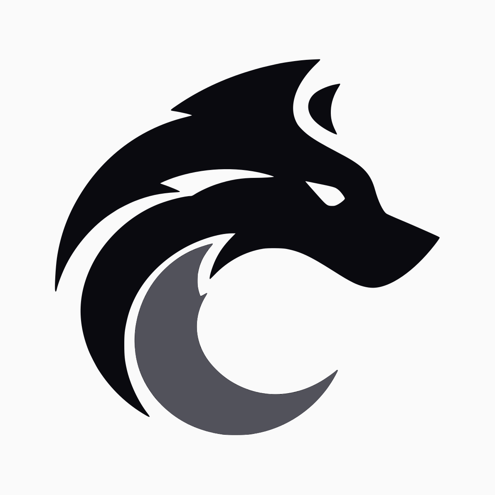

  

# @ironfang/n8n-nodes-ironfang

Community node for using [Ironfang](https://ironfang.uk) APIs in n8n
workflows. Pick a product under Resource, then an operation within it.

Renderwolf is the first product. It turns URLs, HTML and stored templates
into screenshots, PDFs and social images, hosted on infrastructure Ironfang
operates in the UK.

## Install

In n8n, open Settings, then Community Nodes, choose Install and enter
`@ironfang/n8n-nodes-ironfang`.

You'll need an API key from [portal.ironfang.uk](https://portal.ironfang.uk).
The free plan gives 100 renders a month and doesn't ask for a card. Paste the
key into a new Ironfang API credential; the credential test calls
`/v1/usage`, so a bad key fails fast.

## Renderwolf operations

Screenshot captures a URL or raw HTML as a PNG or JPEG. It supports viewport
sizing, full-page capture, capturing a single element by CSS selector, dark
mode and a settle delay for late-painting pages.

PDF prints a URL or raw HTML. Landscape, printed backgrounds, header and
footer templates and page scale are all options.

Template Image renders a stored template with your variables, built for OG
images and social cards.

All three of the above put the rendered file on the item as binary data,
ready for the next node in the workflow.

Signed URL mints a stable render URL you can drop straight into an ``
tag or `og:image` meta tag, and Usage reports the current period's
consumption against your plan cap. Both return JSON.

Identical requests are served from cache and don't count against your plan.
Renders are capped at 120 a minute per account, and 60 a minute per site
being rendered, counted across everyone. Bot protection is never bypassed:
a challenge page is captured as a challenge page.

## Coming from the Renderwolf package

This replaces `@ironfang/n8n-nodes-renderwolf`, which is deprecated. n8n asks
for one node per vendor, so the node is named after the company and
Renderwolf sits inside it as a resource. Install this package, add an
Ironfang API credential with the same key, and swap the node in your
workflows. The operations and their fields are unchanged.

## Links

- [API reference](https://ironfang.uk/renderwolf/docs)
- [OpenAPI spec](https://api.ironfang.uk/openapi.yaml)
- [n8n community nodes documentation](https://docs.n8n.io/integrations/community-nodes/)

## License

MIT
